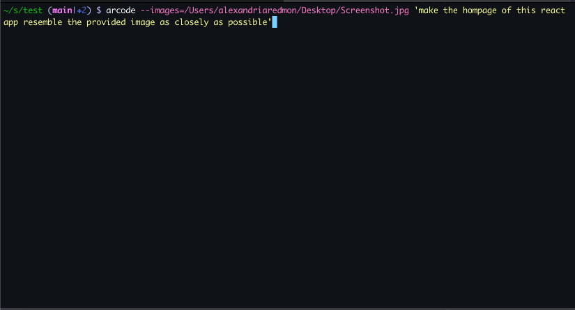
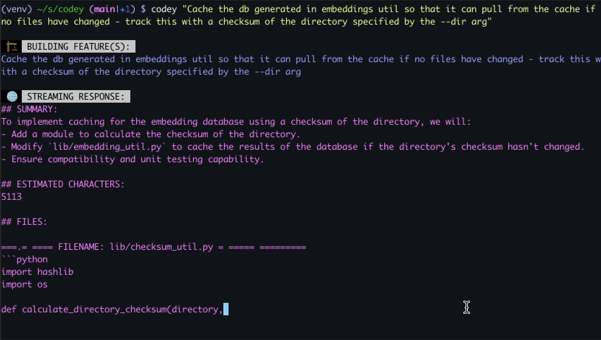
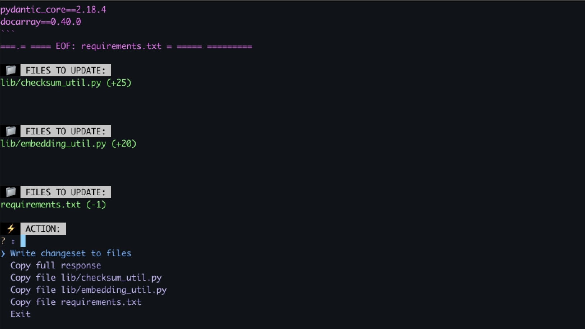

# arcode


## Description

Arcode is a command-line tool designed to help facilitate holistic software development via LLM. It allows users to generate feature implementations for a given codebase based on user-defined requirements.

## Features

- Provide requirements and get recommended changes
- Single button press confirmation + implementation
- Supplies context from your repo/local files
- Optional limiting of file context based on relevancy to features
- Support for various providers/models via LiteLLM

## Demo


### Provide your requirements:


### Review and approve changes:


## Examples:
Generate a plan and optionally write the changes based on requirements:
```bash
arcode "Implement authentication"
```

Use with input from a file:
```bash
cat feature_requirements.txt | arcode --dir ./my_codebase
```

## Install

1. Ensure [Homebrew](https://brew.sh/) is installed
2. Tap `alexdredmon/arcode`
    ```bash
    brew tap alexdredmon/arcode
    ```
3. Install arcode
    ```bash
    brew install arcode
    ```

## Development Setup

1. Clone the repository:
    ```bash
    git clone https://github.com/alexdredmon/arcode
    cd arcode
    ```
2. Create & activate virtual environment:
    ```bash
    virtualenv venv
    source venv/bin/activate
    ```

3. Install the required dependencies:
    ```bash
    pip install -r requirements.txt
    ```

4. Set your OpenAI API key:
    ```bash
    export OPENAI_API_KEY=<your_openai_api_key>
    ```
    or alternatively set in a .env file:
    ```bash
    OPENAI_API_KEY=<your_openai_api_key>
    ```

## Build

1. Build a standalone executable via:

    ```bash
    ./build.sh
    ```

2. A binary will be created in `./dist/arcode/arcode`
3. Add the resulting binary to your PATH to run it anywhere:
    ```bash
    export PATH="/Users/yourusername/path/to/dist/arcode:$PATH"
    ```

## Homebrew Installation

To install Arcode via Homebrew:

1. Clone the repository and navigate into the project directory:
    ```bash
    git clone https://github.com/alexdredmon/arcode
    cd arcode
    ```

2. Run the build script to generate the standalone executable and Homebrew formula:
    ```bash
    ./build.sh
    ```

3. Move the generated formula into your local Homebrew formula directory:
    ```bash
    mkdir -p $(brew --prefix)/Homebrew/Library/Taps/homebrew/homebrew-core/Formula/
    cp Formula/arcode.rb $(brew --prefix)/Homebrew/Library/Taps/homebrew/homebrew-core/Formula/
    ```

4. Install the formula:
    ```bash
    brew install arcode
    ```

## Usage

Run Arcode with and pass it your requirements:
```bash
arcode "Build feature X"
```
Or if you're running the .py version, run with one of the following:
```bash
./arcode.py "Build feature X"
python arcode.py "Build feature X"
```

## Configuration

You can pass configuration via CLI arguments or by creating an `arcodeconf.yml` file in the root of your project working directory.  An `arcodeconf.yml` file can set arguments and environment variables for a project.

Sample `arcodeconf.yml`:
```yaml
args:
  model: anthropic/claude-3-opus-20240229
env:
  ANTHROPIC_API_KEY: 3xampl3
```

## Arguments:
```bash
usage: arcode.py [-h] [--dir DIR] [--autowrite AUTOWRITE] [--focused FOCUSED] [--model MODEL] [--model_embedding MODEL_EMBEDDING]
                 [--mode {implement,question}]
                 [requirements ...]

positional arguments:
  requirements          Requirements for features to build on the codebase or question to ask about the codebase.

options:
  -h, --help            show this help message and exit
  --dir DIR             The working directory of the codebase, default to current directory.
  --autowrite AUTOWRITE
                        Whether or not to immediately write the changeset. Useful when piping to arcode, e.g. cat feature.txt | arcode
  --focused FOCUSED     Enable focused mode to limit files based on relevancy using embeddings - accepts an integer containing number of files to limit
                        context to.
  --model MODEL         Specify the LLM provider/model to use with LiteLLM, default to openai/gpt-4o.
  --model_embedding MODEL_EMBEDDING
                        Specify the LLM provider/model to use for embeddings with LiteLLM, default to openai/text-embedding-3-small.
  --mode {implement,question}
                        Specify the mode for the tool: "implement" for feature building and "question" for asking questions about the codebase.
```

## Models

Popular supported models include:

 - `openai/gpt-4o`
 - `anthropic/claude-3-opus-20240229`
 - `anthropic/claude-3-sonnet-20240229`

Popular supported embedding models include:

 - `openai/text-embedding-3-small`

## API Keys

Set API keys based on the provider(s) you're using - these values should be present in either your shell environment, an `.env` file in the working directory, or the `env` section of an `arcodeconf.yml` file located in the working directory.

### OpenAI
 - `OPENAI_API_KEY`

### Anthropic
 - `ANTHROPIC_API_KEY`

### Gemini
 - `GEMINI_API_KEY`

### Azure
 - `AZURE_API_KEY`
 - `AZURE_API_BASE`
 - `AZURE_API_VERSION`

## License
This project is licensed under the MIT License. See the LICENSE file for more details.

## Contributing
Contributions are welcome! Please fork the repository and submit a pull request with your changes.